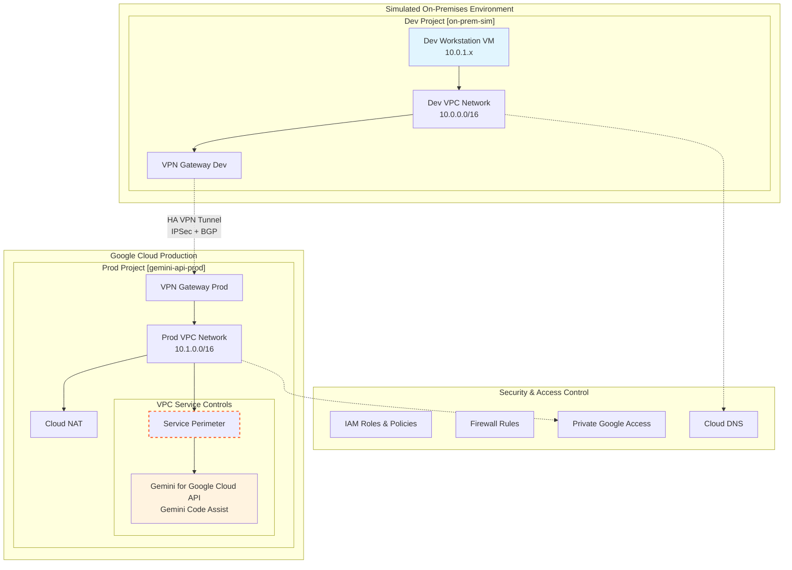
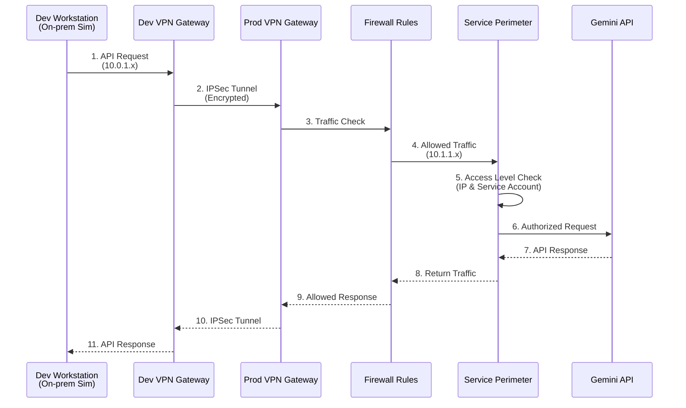

# GCP Hybrid Network Simulation with Gemini API

이 프로젝트는 on-premises 환경과 Google Cloud 간의 하이브리드 네트워크를 시뮬레이션합니다.
Cloud VPN을 통해 안전하게 Gemini Code Assist API에 접근하는 환경을 구성합니다.

## 아키텍처 개요



### 아키텍처 구성 요소

- **Dev Project (on-prem-sim)**: On-premises 환경 시뮬레이션
  - Dev Workstation VM: VS Code/JetBrains IDE 환경 시뮬레이션
  - Dev VPC Network: 10.0.0.0/16 CIDR 범위
  - Private Google Access: 비활성화 (실제 on-premises 환경 시뮬레이션)
  
- **Prod Project (gemini-api-prod)**: Gemini API가 호스팅되는 production 환경
  - Prod VPC Network: 10.1.0.0/16 CIDR 범위
  - VPC Service Controls: API 보안을 위한 Service Perimeter (선택사항)
  - Gemini API 엔드포인트 보호
  
- **네트워크 연결**
  - HA Cloud VPN: 고가용성 VPN Gateway
  - IPSec 터널: 암호화된 연결
  - BGP 라우팅: 자동 경로 교환
  
- **보안 계층**
  - IAM 역할 기반 액세스 제어
  - 방화벽 규칙으로 트래픽 제어
  - Private Google Access로 안전한 API 접근
  - VPC Service Controls로 데이터 유출 방지

## 사전 요구사항

1. Google Cloud SDK (gcloud) 설치
2. Terraform 설치 (v1.0 이상)
3. GCP Organization 및 Billing Account
4. 적절한 IAM 권한

## 설정 방법

1. 변수 설정
```bash
cp terraform.tfvars.example terraform.tfvars
# terraform.tfvars 파일을 편집하여 실제 값 입력
```

2. Terraform 초기화
```bash
terraform init
```

3. 계획 검토
```bash
terraform plan
```

4. 인프라 생성
```bash
terraform apply
```

## 데이터 플로우 다이어그램



## 주요 구성 요소

### 네트워크 구성
| 구성 요소 | CIDR | 용도 |
|---------|------|-----|
| Dev VPC | 10.0.0.0/16 | On-premises 시뮬레이션 |
| Dev Subnet | 10.0.1.0/24 | 개발 워크스테이션 |
| Prod VPC | 10.1.0.0/16 | Production 환경 |
| Prod Subnet | 10.1.1.0/24 | API 서비스 |

### VPN 구성
- **HA VPN Gateway**: 99.99% SLA 보장
- **듀얼 터널**: 각 Gateway당 2개 터널 (총 4개)
- **BGP 라우팅**: ASN 64512 (Dev), ASN 64513 (Prod)
- **IPSec**: IKEv2 프로토콜 사용

### 보안 계층
1. **네트워크 레벨**
   - 방화벽 규칙으로 트래픽 제어
   - Private Google Access: Prod 환경에서만 활성화
   - Cloud NAT: Prod 환경에서만 사용

2. **IAM 레벨**
   - Service Account 기반 인증
   - 최소 권한 원칙 적용
   - Audit 로깅 활성화

3. **API 레벨** (VPC Service Controls)
   - Service Perimeter로 데이터 유출 방지
   - Access Level로 접근 제어
   - Context-aware access

## 테스트 방법

1. Dev VM에 SSH 접속
```bash
gcloud compute ssh dev-workstation --zone=us-central1-a --project=on-prem-sim
```

2. Prod 네트워크 연결 테스트
```bash
ping 10.1.1.2  # Prod 네트워크의 리소스
```

3. Gemini API 테스트
```bash
curl -H "Authorization: Bearer $(gcloud auth print-access-token)" \
  https://us-central1-aiplatform.googleapis.com/v1/projects/gemini-api-prod/locations/us-central1/publishers/google/models/gemini-pro:predict
```

## 정리

```bash
terraform destroy
```

## 비용 최적화 팁

- 사용하지 않을 때는 VM 인스턴스 중지
- VPN은 시간당 과금되므로 테스트 후 삭제 고려
- Free Tier 리소스 활용