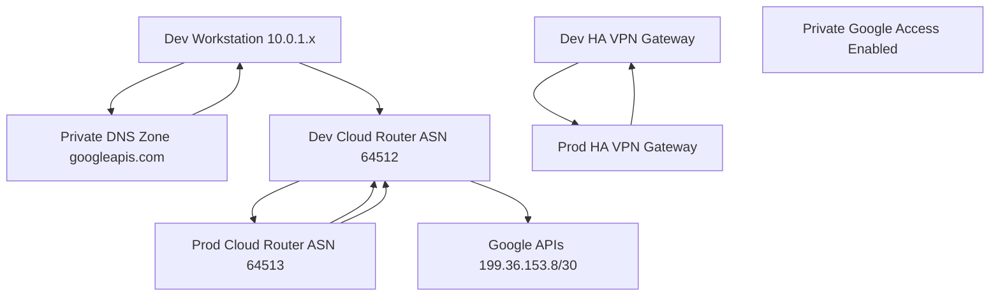

# GCP Hybrid Network Simulation for Private API Access

이 프로젝트는 on-premises 환경을 시뮬레이션하여, Cloud VPN을 통해 Google Cloud의 서비스(예: Gemini API)에 **공용 인터넷을 거치지 않고 비공개로 안전하게 접근**하는 하이브리드 네트워크 환경을 구축하고 검증합니다.

이 과정을 통해 우리는 Google Cloud의 Private Google Access가 BGP와 연동하여 동작하는 핵심 원리를 발견하고 증명합니다.

## 목차

- [아키텍처](#아키텍처)
- [핵심 동작 원리](#핵심-동작-원리)
- [Terraform 코드 구성](#terraform-코드-구성)
- [설정 및 배포](#설정-및-배포)
- [검증 방법](#검증-방법)
- [테스트 및 문제 해결 스크립트](#테스트-및-문제-해결-스크립트)
- [리소스 정리](#리소스-정리)

## 아키텍처



## 핵심 동작 원리

이 아키텍처의 핵심은 **"BGP 경로 광고가 곧 접근 권한"**이라는 점입니다.

1.  **DNS 해석 (On-Premises)**: On-Prem VM이 `aiplatform.googleapis.com`을 조회하면, 자체 비공개 DNS 영역이 `199.36.153.x`와 같은 비공개 IP를 반환합니다.
2.  **경로 광고 (GCP)**: GCP VPC의 Cloud Router가 BGP를 통해 **`199.36.153.8/30` 경로를 알고 있다고 VPN 터널 너머로 광고**합니다.
3.  **라우팅 (On-Premises)**: On-Prem Cloud Router는 이 광고를 수신하여, `199.36.153.x`로 가는 경로는 VPN 터널을 통과해야 한다는 것을 학습합니다.
4.  **API 호출**: On-Prem VM이 비공개 IP로 API를 호출하면, 학습된 경로에 따라 트래픽이 **VPN 터널을 통해 Google 네트워크로 안전하게 전달**됩니다.
5.  **접근 허가**: Google 네트워크 엣지는 신뢰할 수 있는 VPN 연결을 통해 들어온 트래픽이고, 해당 연결의 BGP 세션이 목적지 경로를 광고하고 있음을 확인하고, **API 접근을 최종적으로 허용**합니다.

**중요**: 실제 API 트래픽은 GCP VPC를 경유하지 않으며, GCP VPC의 역할은 오직 BGP 경로를 광고하여 On-Prem 환경에 경로 정보를 알려주고 접근을 허가하는 **"관문"** 역할에 있습니다.

## Terraform 코드 구성

이 프로젝트의 인프라는 여러 Terraform 파일로 모듈화되어 관리됩니다.

| 파일명 | 설명 |
| --- | --- |
| `main.tf` | Terraform 프로바이더, 백엔드 설정 등 프로젝트의 기본 구성을 정의합니다. |
| `variables.tf` | 프로젝트 ID, 리전 등 인프라 구성에 필요한 변수들을 정의합니다. |
| `networks.tf` | On-Prem 및 GCP 환경의 VPC 네트워크, 서브넷을 생성합니다. |
| `compute.tf` | On-Prem 환경을 시뮬레이션하기 위한 `dev-workstation` VM을 생성합니다. |
| `vpn.tf` | 두 환경을 연결하는 HA VPN 게이트웨이, 터널, Cloud Router를 구성합니다. |
| `firewall.tf` | IAP를 통한 SSH 접속, 내부 통신 등을 위한 방화벽 규칙을 정의합니다. |
| `dns.tf` | Google API의 비공개 접근을 위해 `googleapis.com`을 재정의하는 Cloud DNS 비공개 영역을 설정합니다. |
| `iam.tf` | 리소스 배포 및 관리에 필요한 최소한의 IAM 역할을 정의합니다. |
| `outputs.tf` | 배포 후 생성된 리소스의 주요 정보(예: 프로젝트 ID)를 출력합니다. |

## 설정 및 배포

1.  **변수 설정**: `terraform.tfvars.example` 파일을 `terraform.tfvars`로 복사하고, 자신의 환경에 맞게 값을 수정합니다. 특히 `project_prefix`는 고유한 값으로 변경해야 합니다.

2.  **인프라 배포**:
    ```bash
    terraform init
    terraform apply
    ```

## 검증 방법

배포가 완료된 후, 다음 단계를 통해 아키텍처가 올바르게 작동하는지 검증할 수 있습니다.

### 1. Dev VM 접속
```bash
# [project-suffix]는 terraform output으로 확인
gcloud compute ssh dev-workstation --zone=us-central1-a --project=on-prem-sim-[project-suffix]
```

### 2. DNS 해석 확인
Dev VM에서 실행합니다. `199.36.153.x` 범위의 비공개 IP가 반환되어야 합니다.
```bash
nslookup aiplatform.googleapis.com
```

### 3. 네트워크 경로 확인
`traceroute`를 사용하여 트래픽이 비공개 경로로 전달되는지 확인합니다. 중간에 공인 IP 없이, VPN 터널을 통해 목적지 IP(`199.36.153.x`)로 바로 도달해야 합니다.
```bash
sudo traceroute -T -p 443 aiplatform.googleapis.com
```

### 4. Gemini API 호출 테스트
`test_gemini_api.py` 스크립트를 사용하여 실제 API 호출이 성공하는지 확인합니다.
```bash
# Dev VM에서 실행
python3 test_scripts/test_gemini_api.py
```

## 테스트 및 문제 해결 스크립트

`test_scripts/` 디렉터리에는 배포 환경을 검증하고 문제를 해결하는 데 도움이 되는 다양한 스크립트가 포함되어 있습니다.

| 스크립트명 | 설명 |
| --- | --- |
| `quick_start.sh` | 전체 배포 및 검증 과정을 자동화합니다. |
| `test_connectivity.sh` | On-Prem VM에서 GCP VM으로의 기본적인 네트워크 연결을 테스트합니다. |
| `test_dns_configuration.sh` | DNS 설정이 올바르게 구성되었는지 확인합니다. |
| `test_gemini_api.py` | Dev VM에서 Gemini API를 호출하여 비공개 연결을 최종 검증합니다. |
| `diagnose_*.sh` | VPN, DNS 등 특정 구성 요소의 문제를 진단하는 데 사용되는 스크립트 모음입니다. |
| `*.md` | 특정 문제 해결 가이드 또는 아키텍처에 대한 추가 설명 문서입니다. |

## 리소스 정리

인프라 사용이 끝나면 반드시 다음 명령어를 실행하여 모든 리소스를 삭제하고 비용이 발생하지 않도록 합니다.
```bash
terraform destroy