# GCP Hybrid Network Simulation for Private API Access

이 프로젝트는 on-premises 환경을 시뮬레이션하여, Cloud VPN을 통해 Google Cloud의 서비스(예: Gemini API)에 **공용 인터넷을 거치지 않고 비공개로 안전하게 접근**하는 하이브리드 네트워크 환경을 구축하고 검증합니다.

이 과정을 통해 우리는 Google Cloud의 Private Google Access가 BGP와 연동하여 동작하는 핵심 원리를 발견하고 증명합니다.

## 목차

- [아키텍처](#아키텍처)
- [핵심 동작 원리](#핵심-동작-원리)
- [Terraform 코드 구성](#terraform-코드-구성)
- [설정 및 배포](#설정-및-배포)
- [검증 방법](#검증-방법)
- [테스트 및 문제 해결 스크립트](#테스트-및-문제-해결-스크립트)
- [리소스 정리](#리소스-정리)

## 아키텍처

```mermaid
graph TB
    subgraph DevProject["🏢 Dev Project: on-prem-sim-{suffix}"]
        subgraph DevVPC["VPC: dev-vpc (10.0.0.0/16)"]
            subgraph DevSubnet["Subnet: dev-subnet (10.0.1.0/24)"]
                DevVM["🖥️ dev-workstation<br/>Type: e2-medium<br/>OS: Debian 11<br/>IP: 10.0.1.x<br/>Tags: iap-ssh, vpn-allowed"]
            end
            
            DevDNS["🌐 Private DNS Zone<br/>googleapis.com<br/>→ 199.36.153.8-11"]
            
            DevVPN["🔐 HA VPN Gateway<br/>dev-vpn-gateway<br/>2 Interfaces"]
            
            DevRouter["🔄 Cloud Router<br/>dev-vpn-router<br/>ASN: 64512<br/>Advertises: 10.0.1.0/24"]
            
            subgraph DevFirewall["🛡️ Firewall Rules"]
                FW1["dev-allow-iap-ssh<br/>Source: 35.235.240.0/20<br/>Port: 22"]
                FW2["dev-allow-internal<br/>Source: 10.0.0.0/16, 10.1.0.0/16<br/>All ports"]
                FW3["dev-allow-vpn<br/>ESP, UDP 500/4500"]
            end
        end
        
        DevSA["🔑 Service Account<br/>dev-vm-sa<br/>Roles:<br/>- aiplatform.user (both projects)<br/>- logging.logWriter<br/>- monitoring.metricWriter"]
    end
    
    subgraph ProdProject["🏢 Prod Project: gemini-api-prod-{suffix}"]
        subgraph ProdVPC["VPC: prod-vpc (10.1.0.0/16)"]
            subgraph ProdSubnet["Subnet: prod-subnet (10.1.1.0/24)"]
                ProdVM["🖥️ prod-test-vm<br/>Type: e2-micro<br/>OS: Debian 11<br/>IP: 10.1.1.x"]
            end
            
            ProdVPN["🔐 HA VPN Gateway<br/>prod-vpn-gateway<br/>2 Interfaces"]
            
            ProdRouter["🔄 Cloud Router<br/>prod-vpn-router<br/>ASN: 64513<br/>Advertises:<br/>- 10.1.1.0/24<br/>- 199.36.153.8/30 (PGA)"]
            
            subgraph ProdFirewall["🛡️ Firewall Rules"]
                PFW1["prod-allow-vpn<br/>ESP, UDP 500/4500"]
                PFW2["prod-allow-internal<br/>Source: 10.0.0.0/16, 10.1.0.0/16"]
                PFW3["prod-restrict-api-access<br/>Source: 10.0.1.0/24<br/>Port: 443"]
                PFW4["prod-deny-ssh<br/>Deny all SSH"]
            end
        end
    end
    
    subgraph VPNConnection["🔗 VPN Connection"]
        Tunnel1["Tunnel 1<br/>dev-to-prod-tunnel1 ↔ prod-to-dev-tunnel1<br/>Interface 0"]
        Tunnel2["Tunnel 2<br/>dev-to-prod-tunnel2 ↔ prod-to-dev-tunnel2<br/>Interface 1"]
        
        BGP1["BGP Session 1<br/>169.254.0.1/30 ↔ 169.254.0.2/30"]
        BGP2["BGP Session 2<br/>169.254.1.1/30 ↔ 169.254.1.2/30"]
    end
    
    subgraph GoogleServices["☁️ Google Cloud Services"]
        GoogleAPIs["Google APIs<br/>private.googleapis.com<br/>199.36.153.8/30"]
        GeminiAPI["Gemini API<br/>aiplatform.googleapis.com"]
    end
    
    subgraph APIs["📋 Enabled APIs"]
        DevAPIs["Dev Project APIs:<br/>- compute<br/>- dns<br/>- iam<br/>- aiplatform"]
        ProdAPIs["Prod Project APIs:<br/>- compute<br/>- iam<br/>- aiplatform<br/>- cloudaicompanion"]
    end
    
    %% Connections
    DevVM -->|"1. DNS Query"| DevDNS
    DevDNS -->|"2. Returns 199.36.153.x"| DevVM
    DevVM -->|"3. API Request"| DevRouter
    DevRouter -->|"4. Routes via VPN"| DevVPN
    
    DevVPN -.->|"HA VPN"| Tunnel1
    DevVPN -.->|"HA VPN"| Tunnel2
    Tunnel1 -.->|"HA VPN"| ProdVPN
    Tunnel2 -.->|"HA VPN"| ProdVPN
    
    DevRouter <-->|"BGP"| BGP1
    DevRouter <-->|"BGP"| BGP2
    BGP1 <-->|"BGP"| ProdRouter
    BGP2 <-->|"BGP"| ProdRouter
    
    ProdRouter -->|"5. Advertises PGA routes"| GoogleAPIs
    DevVM -.->|"6. Private API Access"| GeminiAPI
    
    DevVM -.->|"Uses"| DevSA
    ProdVM -.->|"Internal only"| ProdSubnet
    
    style DevProject fill:#e3f2fd
    style ProdProject fill:#fff3e0
    style VPNConnection fill:#f3e5f5
    style GoogleServices fill:#e8f5e9
```



## 핵심 동작 원리

이 아키텍처의 핵심은 **"BGP 경로 광고가 곧 접근 권한"**이라는 점입니다.

1.  **DNS 해석 (On-Premises)**: On-Prem VM이 `aiplatform.googleapis.com`을 조회하면, 자체 비공개 DNS 영역이 `199.36.153.x`와 같은 비공개 IP를 반환합니다.
2.  **경로 광고 (GCP)**: GCP VPC의 Cloud Router가 BGP를 통해 **`199.36.153.8/30` 경로를 알고 있다고 VPN 터널 너머로 광고**합니다.
3.  **라우팅 (On-Premises)**: On-Prem Cloud Router는 이 광고를 수신하여, `199.36.153.x`로 가는 경로는 VPN 터널을 통과해야 한다는 것을 학습합니다.
4.  **API 호출**: On-Prem VM이 비공개 IP로 API를 호출하면, 학습된 경로에 따라 트래픽이 **VPN 터널을 통해 Google 네트워크로 안전하게 전달**됩니다.
5.  **접근 허가**: Google 네트워크 엣지는 신뢰할 수 있는 VPN 연결을 통해 들어온 트래픽이고, 해당 연결의 BGP 세션이 목적지 경로를 광고하고 있음을 확인하고, **API 접근을 최종적으로 허용**합니다.

**중요**: 실제 API 트래픽은 GCP VPC를 경유하지 않으며, GCP VPC의 역할은 오직 BGP 경로를 광고하여 On-Prem 환경에 경로 정보를 알려주고 접근을 허가하는 **"관문"** 역할에 있습니다.

## Terraform 코드 구성

이 프로젝트의 인프라는 여러 Terraform 파일로 모듈화되어 관리됩니다.

| 파일명 | 설명 |
| --- | --- |
| `main.tf` | Terraform 프로바이더, 백엔드 설정 등 프로젝트의 기본 구성을 정의합니다. |
| `variables.tf` | 프로젝트 ID, 리전 등 인프라 구성에 필요한 변수들을 정의합니다. |
| `networks.tf` | On-Prem 및 GCP 환경의 VPC 네트워크, 서브넷을 생성합니다. |
| `compute.tf` | On-Prem 환경을 시뮬레이션하기 위한 `dev-workstation` VM을 생성합니다. |
| `vpn.tf` | 두 환경을 연결하는 HA VPN 게이트웨이, 터널, Cloud Router를 구성합니다. |
| `firewall.tf` | IAP를 통한 SSH 접속, 내부 통신 등을 위한 방화벽 규칙을 정의합니다. |
| `dns.tf` | Google API의 비공개 접근을 위해 `googleapis.com`을 재정의하는 Cloud DNS 비공개 영역을 설정합니다. |
| `iam.tf` | 리소스 배포 및 관리에 필요한 최소한의 IAM 역할을 정의합니다. |
| `outputs.tf` | 배포 후 생성된 리소스의 주요 정보(예: 프로젝트 ID)를 출력합니다. |

## 설정 및 배포

1.  **변수 설정**: `terraform.tfvars.example` 파일을 `terraform.tfvars`로 복사하고, 자신의 환경에 맞게 값을 수정합니다. 특히 `project_prefix`는 고유한 값으로 변경해야 합니다.

2.  **인프라 배포**:
    ```bash
    terraform init
    terraform apply
    ```

## 검증 방법

배포가 완료된 후, 다음 단계를 통해 아키텍처가 올바르게 작동하는지 검증할 수 있습니다.

### 1. Dev VM 접속
```bash
# [project-suffix]는 terraform output으로 확인
gcloud compute ssh dev-workstation --zone=us-central1-a --project=on-prem-sim-[project-suffix]
```

### 2. DNS 해석 확인
Dev VM에서 실행합니다. `199.36.153.x` 범위의 비공개 IP가 반환되어야 합니다.
```bash
nslookup aiplatform.googleapis.com
```

### 3. 네트워크 경로 확인
`traceroute`를 사용하여 트래픽이 비공개 경로로 전달되는지 확인합니다. 중간에 공인 IP 없이, VPN 터널을 통해 목적지 IP(`199.36.153.x`)로 바로 도달해야 합니다.
```bash
sudo traceroute -T -p 443 aiplatform.googleapis.com
```

### 4. Gemini API 호출 테스트
`test_gemini_api.py` 스크립트를 사용하여 실제 API 호출이 성공하는지 확인합니다.
```bash
# Dev VM에서 실행
python3 test_scripts/test_gemini_api.py
```

## 테스트 및 문제 해결 스크립트

`test_scripts/` 디렉터리에는 배포 환경을 검증하고 문제를 해결하는 데 도움이 되는 다양한 스크립트가 포함되어 있습니다.

| 스크립트명 | 설명 |
| --- | --- |
| `quick_start.sh` | 전체 배포 및 검증 과정을 자동화합니다. |
| `test_connectivity.sh` | On-Prem VM에서 GCP VM으로의 기본적인 네트워크 연결을 테스트합니다. |
| `test_dns_configuration.sh` | DNS 설정이 올바르게 구성되었는지 확인합니다. |
| `test_gemini_api.py` | Dev VM에서 Gemini API를 호출하여 비공개 연결을 최종 검증합니다. |
| `diagnose_*.sh` | VPN, DNS 등 특정 구성 요소의 문제를 진단하는 데 사용되는 스크립트 모음입니다. |
| `*.md` | 특정 문제 해결 가이드 또는 아키텍처에 대한 추가 설명 문서입니다. |

## 리소스 정리

인프라 사용이 끝나면 반드시 다음 명령어를 실행하여 모든 리소스를 삭제하고 비용이 발생하지 않도록 합니다.
```bash
terraform destroy